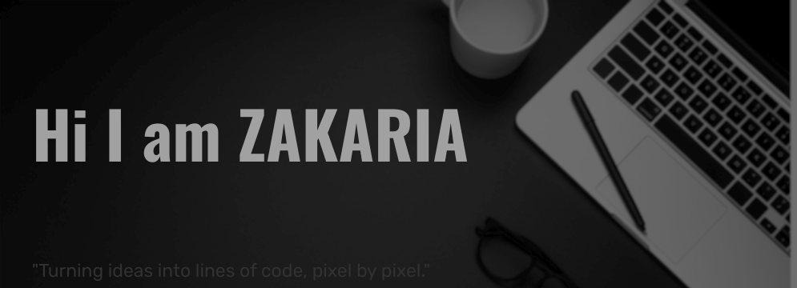

<!--
**zakariae111/zakariae111** is a ✨ _special_ ✨ repository because its `README.md` (this file) appears on your GitHub profile.

<h1 align="center">Hi ,</h1>
<h3 align="center">A future fullstack developer from Morocco 🚀</h3>
 

...

 
<!---
- Web illustrations by Storyset ( https://storyset.com/illustration/programming/pana )
--->

 

👋 Hey there, I'm ZAKARIA AKZIZ – a passionate Full Stack Developer on a mission to bring digital ideas to life.  
With a love for both frontend creativity and backend logic, I thrive on crafting seamless user experiences and robust systems. 
 
My GitHub is a canvas where code meets creativity, showcasing my journey in the world of tech. 
 
Let's collaborate and create something amazing together! 🚀🔥

- 📫 How to reach me: **<a href="mailto:akziz2zakaria@gmail.com">zakaria</a>**.
 
 

<h2 align="center">🧰 Languages and Tools</h2>

 
<!---*** HTML5 ***---> 

<!---*** CSS3 ***--->

  
<!---*** Js ***---><a href="https://developer.mozilla.org/en-US/docs/Web/JavaScript" target="_blank" rel="noreferrer"> 

<!---*** Sass ***--->

  <!---*** BOOTSTRAP ***--->

<!---*** tailwind ***--->
  
<!---*** Python ***--->

<!---*** PHP ***--->

<!---*** LARAVEL ***---> 

<!---*** GIT ***---> 

<!---*** Linux ***---> 

 

 

<!---

- 👨‍💻 You can also check out my portfolio at [https://zakariae111.github.io/](https://zakariae111.github.io/)
- 💬 Ask me about **Html**
inspired from melvinaguilar

--->
